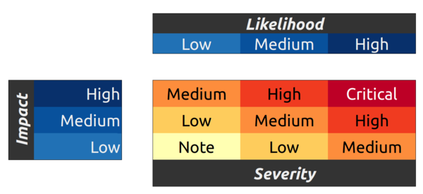

# Bug bounty program of the LibreBank project (including LibreCash)

**LibreBank** is a decentralized autonomous organization (DAO) and a reserve fund dedicated to maintain operation of LibreCash - a stable value cryptocurrency.

  
We do everything to ensure security and privacy of our users and our aim is to create the best product in the segment. That’s why we are launching the bug bounty program.

  

## The following contracts are part of the program:

  

 

- LBRS (ERC20 Token):  
[https://github.com/LibreCash/contracts/blob/master/contracts/token/LibertyToken.sol](https://github.com/LibreCash/contracts/blob/master/contracts/token/LibertyToken.sol)

- LibreCash (ERC20 Token): [https://github.com/LibreCash/contracts/blob/master/contracts/token/LibreCash.sol](https://github.com/LibreCash/contracts/blob/master/contracts/token/LibreCash.sol)

- Autonomous exchange contract (ComplexExchanger):
[https://github.com/LibreCash/contracts/blob/master/contracts/ComplexExchanger.sol](https://github.com/LibreCash/contracts/blob/master/contracts/ComplexExchanger.sol)
- Autonomous emission contract (ComplexBank):
[https://github.com/LibreCash/contracts/blob/dev/contracts/ComplexExchanger.sol](https://github.com/LibreCash/contracts/blob/dev/contracts/ComplexExchanger.sol)

## Bug bounty program terms and conditions

The bounty will follow the standard Ethereum Foundation bug bounty severity classifications.

We will accept only unique and new bugs. However, we’re trying to encourage all our security researchers who contribute to the project. We’ll be happy to hear your suggestions, wishes, and recommendations as well that will also be accounted and paid individually depending on their severity and value.

Severity of a bug will be evaluated by the dev team and the community.

### Depending on the severity of the problem there are following options of rewards:

1. **Remark or a minor issue:** from 50 to 150 LibreCash (Libre)

2. **Significant bug that affects core functionality**: from 150 to 750 LibreCash (Libre)

3. **Critical error**: from 500 to 1500 LibreCash (Libre)

In certain cases reward can be increased at the discretion of the project team.

  

## Bug report format
To take part in our bug bounty program email your bug report to [bounty@librebank.com](mailto:bounty@librebank.com).

  
**The report has to contain the following information:**

1. Your name or nickname
2. Contract title, analyzed file version (commit hash)
3. Short description of the bug including line number and fragment containing the bug (when applicable),
4. Your personal severity estimation
5. Use case or other demonstration of the problem
6. Your Ethereum wallet
7. Additional contact info

Taking part in the bug bounty program you agree to not publishing any information on the bug found before it is fixed and disclosure is approved by the dev team. Thus you’ll prevent excessive duplication and promote the project’s growth.
