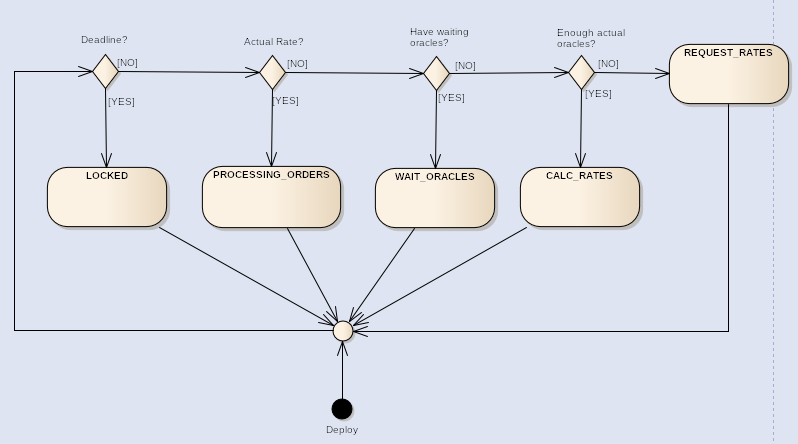

# ComplexExchanger contract specifications

# System overview

The ComplexExchanger is a contract for exchanging stablecoin token (LibreCash) and liquid asset (Ethereum) in both directions.

# Contract constants

<table>
  <tr>
    <td>Name</td>
    <td>Type</td>
    <td>Description</td>
  </tr>
  <tr>
    <td>oracles</td>
    <td>address[]</td>
    <td>an array of oracle addresses</td>
  </tr>
  <tr>
    <td>tokenAddress</td>
    <td>address</td>
    <td>LibreCash token address</td>
  </tr>
  <tr>
    <td>deadline</td>
    <td>uint256</td>
    <td> contract lifetime (unix timestamp)</td>
  </tr>
  <tr>
    <td>withdrawWallet</td>
    <td>address</td>
    <td>address of the wallet for withdrawing reserve after the deadline</td>
  </tr>
  <tr>
    <td>ORACLE_ACTUAL</td>
    <td>uint256</td>
    <td>the time interval for which the oracle rate is up-to-date</td>
  </tr>
  <tr>
    <td>ORACLE_TIMEOUT</td>
    <td>uint256</td>
    <td>the time interval after which the response to the rate request is considered outdated (response waiting timeout)</td>
  </tr>
  <tr>
    <td>RATE_PERIOD</td>
    <td>uint256</td>
    <td>the period when you can buy and sell with the current rate</td>
  </tr>
  <tr>
    <td>buyFee,
sellFee</td>
    <td>uint256</td>
    <td>Buy and Sell fees (as % multiplied by 100)</td>
  </tr>
  <tr>
    <td>MIN_READY_ORACLES</td>
    <td>uint256</td>
    <td>minimum number of oracles with actual and valid (values between MIN_RATE and MAX_RATE) data excluding pending data. Is checked when calculating rates</td>
  </tr>
  <tr>
    <td>MAX_RATE</td>
    <td>uint256</td>
    <td>5000 * RATE_MULTIPLIER</td>
  </tr>
  <tr>
    <td>MIN_RATE</td>
    <td>uint256</td>
    <td>100 * RATE_MULTIPLIER</td>
  </tr>
  <tr>
    <td>RATE_MULTIPLIER</td>
    <td>uint256</td>
    <td>1000. Coefficient used to calculate and entry rates (for decimals of token count values)</td>
  </tr>
</table>

# Global variables

<table>
  <tr>
    <td>Name</td>
    <td>Type</td>
    <td>Description</td>
  </tr>
  <tr>
    <td>buyRate*</td>
    <td>uint256</td>
    <td>Tokens' buying rate (a user buys tokens from the exchanger)</td>
  </tr>
  <tr>
    <td>sellRate*</td>
    <td>uint256</td>
    <td>Token's selling rate (a user sell tokens to exchanger)</td>
  </tr>
  <tr>
    <td>requestTime</td>
    <td>uint256</td>
    <td>The time (unix timestamp) of the last request to oracles. Used for checking oracle timeouts</td>
  </tr>
  <tr>
    <td>calcTime</td>
    <td>uint256</td>
    <td>The time (unix timestamp) of the last rates calculation. Used for defining time intervals when purchase and sale are allowed</td>
  </tr>
</table>

*multiplied by **RATE_MULTIPLIER**

# Contract states

The contract can be in different states. States define currently available methods

**LOCKED (0)**

The lifetime of the contract (given by the "deadline" variable) has expired.

Users are unable to call any contract methods. Contract Ether reserves can be withdrawn to **withdrawWallet** (contract constant). Contract tokens are burned simultaneously.

**PROCESSING_ORDERS (1)**

The exchange rate is up-to-date; buy and sell methods are allowed.

**WAIT_ORACLES (2)**

Some oracles are still waiting for external data (e.g stocks rate data). **ORACLE_TIMEOUT** period hasn't ended yet. If **ORACLE_TIMEOUT** ends, an oracle is not considered pending.

**CALC_RATES (3)**

There are enough (at least **MIN_READY_ORACLES**) oracles with actual rates and **ORACLE_ACTUAL** period since requestTime for them hasn't ended yet.

User can run **calcRates** method then.

**REQUEST_RATE (4)**

Current rates are outdated.

User can run **requestRates** method to request rates from oracles.

 

# Events

**Event **- software (programming) event used to notify external systems or users of significant contract events. Allows logging, it can be listened in external applications (e.g DAPPs).

## InvalidRate

### Parameters

* *uint256* **rate**;

* *address* **oracle**.

### Description

The event is raised in calcRate method when the oracle rate isn't in allowed range (**MIN_RATE** <= rate <= **MAX_RATE**).

## OracleRequest

### Parameters

* *address* **oracle**.

### Description

The event is raised in requestRates method after each oracle rate is requested.

## Buy, Sell

### Parameters

* *address* **sender**;

* *address* **recipient**;

* *uint256* **tokenAmount**/**cryptoAmount**;

* *uint256* **price**.

### Description

The events are raised after successful Buy and Sell.

## ReserveRefill, ReserveWithdraw

### Parameters

* *uint256* **amount**.

### Description

The events are raised after successful execution of **refillBalance**/**withdrawReserve** methods.

# User roles

## User

Manually performs two-way exchange of ETH and LibreCash.

## Withdraw wallet

Is able to withdraw all contract Ether to itself after the deadline (initially given by the **withdrawWallet**).

# Contract methods

## buyTokens (payable)

### Parameters

* *address ***_recipient - **recipient address or 0x0 if the recipient is the same as sender (the one who called the method);

### Description

Buying tokens from the exchanger.

The purchase method works only if the rate is up-to-date. If the exchanger doesn't have enough tokens, it sends all remaining tokens to the user and immediately refunds unused ether (i.e. automatic conversion into available tokens).

## sellTokens

### Parameters

* *address ***_recipient -****_ _**recipient's address or 0x0 if the recipient is the same as sender (the one who called the method);

* *uint256 ***tokensCount** -**_ _**amount of tokens to sell.

### Description

Selling user's tokens to the exchanger.

The method works only when the rate is up-to-date. If a user tries to sell more tokens than the exchanger is able to purchase, he is credited only for the available amount of tokens.

Before selling a user shall approve token spending to the exchanger (set **allowance** for the amount of tokens equal or more than he wants to sell).

The user can sell only those tokens, on which **allowance** is set. The allowance can be set with standard token functions **approve**, **decreaseApproval**, **increaseApproval** in the token contract.

## requestRates (payable)

### Parameters

no parameters

### Description

Initiates every active oracle's rate requesting method.

The method can be run only if the rate is out-of-date (see **RATE_PERIOD** constant).

Note that a user also must send ether (with this method) sufficient for getting external data by oracles; it is not free. Also see **_requestPrice_*** view method*.

Excessive ether is immediately returned to the sender.

## calcRates

### Parameters

no parameters

### Description

Calculation of buy and sell rates from data received from the oracles.

The method should be run after requestRates and getting enough data from the oracles (either every oracle received  data, or at least **MIN_READY_ORACLES** oracles got data but **ORACLE_TIMEOUT** is over).

## refillBalance

### Parameters

no parameters

### Description

The ether deposit without token purchase. Used to increase the contract reserve.

## withdrawReserve

### Parameters

no parameters

### Description

Withdraws all exchanger’s ether to the **withdrawWallet** address (the constant, see above).

Works only when the exchanger has **LOCKED** state.

It occurs when current time is over **deadline** constant. It is used to avoid losing ether on the contract after the exchanger’s life cycle is over. Also tokens on the contract are simultaneously burned.

## getState (view method)

## Parameters

no parameters

### Description

The method returns the current contract state (number).

## requestPrice

### Parameters

no parameters

### Description

The method returns the amount of ether (in Wei) to be sent with **requestRates** method. It shows the deficient amount of ether for  every oracle request price.

## getOracleData (view method)

### Parameters

* *uint ***number** - oracle’s ID in the contract.

### Description

The method returns oracle parameters:

* address **oracleAddress** - the address of the oracle;

* *bytes32* **oracleName** - the name of the oracle;

* *bytes16* **oracleType** - the oracle’s type;

* bool **waitQuery** - boolean representing if the oracle is waiting for external data (after requesting it);

* uint256 **updateTime** - unix timestamp of data request;

* uint256 **callbackTime** - unix timestamp of receiving external data;

* uint256 **rate** - external data; the rate the oracle received (multiplied by **RATE_MULTIPLIER** constant).

## oracleCount (view method)

### Parameters

no parameters

### Description

The methods returns the oracle count

## tokenBalance (view method)

### Parameters

no parameters

### Description

The methods returns the token balance of the exchanger.

## readyOracles (view method)

### Parameters

no parameters

### Description

The method returns the nuber of oracles with up-to-date rate (if ИМЯ_КОНСТАНТЫ isn't over.

## waitingOracles (view method)

### Parameters

no parameters

### Description

The method returns the number (amount) of oracles for external data if they have been waiting for less than **ORACLE_TIMEOUT**.

