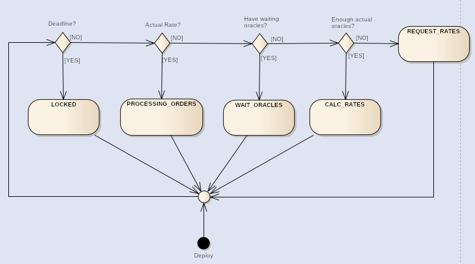

Спецификация контракта ComplexExchanger

# Назначение системы

Рассматриваемая система предназначена для осуществления двунаправленных операций обмена однозначно и единоразово заданного токена (LibreCash) на Ethereum с целью реализации гарантии обеспечения токенов ликвидным активом (Ethereum).

# Константы

<table>
  <tr>
    <td>Имя</td>
    <td>Тип</td>
    <td>Описание</td>
  </tr>
  <tr>
    <td>oracles</td>
    <td>address[]</td>
    <td>массив адресов оракулов</td>
  </tr>
  <tr>
    <td>tokenAddress</td>
    <td>address</td>
    <td>адрес токена LibreCash</td>
  </tr>
  <tr>
    <td>deadline</td>
    <td>uint256</td>
    <td>время жизни контракта (unix timestamp)</td>
  </tr>
  <tr>
    <td>withdrawWallet</td>
    <td>address</td>
    <td>адрес кошелька для вывода резерва после окончания времени жизни контракта</td>
  </tr>
  <tr>
    <td>ORACLE_ACTUAL</td>
    <td>uint256</td>
    <td>период актуальности курса оракула</td>
  </tr>
  <tr>
    <td>ORACLE_TIMEOUT</td>
    <td>uint256</td>
    <td>период, по прошествии которого ответ от оракула считается устаревшим (время ожидания ответа)</td>
  </tr>
  <tr>
    <td>RATE_PERIOD</td>
    <td>uint256</td>
    <td>период актуальности текущего курса (в течение которого можно менять средства)</td>
  </tr>
  <tr>
    <td>buyFee,
sellFee</td>
    <td>uint256</td>
    <td>комиссии на покупку и продажу (в %, умноженных на 100)</td>
  </tr>
  <tr>
    <td>MIN_READY_ORACLES</td>
    <td>uint256</td>
    <td>минимальное количество оракулов с актуальными и валидными (в диапазоне от MIN_RATE до MAX_RATE) данными. Используются при проверке достаточности данных при расчете курса</td>
  </tr>
  <tr>
    <td>MAX_RATE</td>
    <td>uint256</td>
    <td>5000 * RATE_MULTIPLIER</td>
  </tr>
  <tr>
    <td>MIN_RATE</td>
    <td>uint256</td>
    <td>100 * RATE_MULTIPLIER</td>
  </tr>
  <tr>
    <td>RATE_MULTIPLIER</td>
    <td>uint256</td>
    <td>1000. Коэффициент, используемый при расчете и записи курсов (для представления десятичных знаков в целочисленных типах)</td>
  </tr>
</table>

# Глобальные переменные

<table>
  <tr>
    <td>Имя</td>
    <td>Тип</td>
    <td>Описание</td>
  </tr>
  <tr>
    <td>buyRate*</td>
    <td>uint256</td>
    <td>Курс покупки токенов (пользователь покупает токены у обменника)</td>
  </tr>
  <tr>
    <td>sellRate*</td>
    <td>uint256</td>
    <td>Курс продажи токенов (пользователь продает токены обменнику)</td>
  </tr>
  <tr>
    <td>requestTime</td>
    <td>uint256</td>
    <td>Время последнего запроса к оракулам (unix timestamp). Используется для проверки таймаутов оракулов.</td>
  </tr>
  <tr>
    <td>calcTime</td>
    <td>uint256</td>
    <td>Время последнего расчета курсов (unix timestamp). Используется для определения промежутков, когда разрешены продажа и покупка.</td>
  </tr>
</table>

*значения умножены на **RATE_MULTIPLIER**

# Состояния контракта

Контракт может находиться в разных состояниях. Они определяют доступные методы в текущий момент времени.

**LOCKED (0)**

Время жизни контракта, заданное константой deadline, прошло. У пользователей нет возможности вызова каких-либо методов. Резервы контракта могут быть выведены на специальный кошелек (изначально задан константой **withdrawWallet**), при этом токены на контракте обменника сжигаются (уничтожаются).

**PROCESSING_ORDERS (1)**

Курсы обмена актуальны; продажа и покупка по данному курсу разрешены.

**WAIT_ORACLES (2)**

Некоторые оракулы все еще ожидают данные (курсы бирж/обменников). Если с момента запроса курсов проходит **ORACLE_TIMEOUT**, то оракул уже не считается ожидающим.

**CALC_RATES (3)**

Есть достаточно (не менее чем **MIN_READY_ORACLES**) оракулов с актуальным курсом, и интервал **ORACLE_ACTUAL** с момента **requestTime **еще не прошел.

Пользователь может запустить метод **calcRates **для расчета курсов.

**REQUEST_RATE (4)**

Текущие курсы неактуальны.

Пользователь может запустить метод **requestRates** для запроса курсов у оракулов. 

# Events - события

**Event (событие)**- программное событие используемое для извещение внешних систем и пользователей о важных контрактных событиях.

## InvalidRate

### Параметры

* *uint256 ***rate**;

* *address ***oracle**.

### Описание

Событие вызывается в методе calcRate в случае если курс оракула выходит за разрешенные рамки (**MIN_RATE** <= rate <= **MAX_RATE**).

## OracleRequest

### Параметры

* *address ***oracle**.

### Описание

Событие вызывается в методе requestRates после отправки запроса курса каждым из оракулов.

## Buy, Sell

### Параметры

* *address ***sender**;

* *address ***recipient**;

* *uint256 ***tokenAmount**/**cryptoAmount**;

* *uint256 ***price**.

### Описание

События вызываются после успешной продажи и покупки.

## ReserveRefill, ReserveWithdraw

### Параметры

* *uint256 ***amount**.

### Описание

События вызываются после успешного выполнения методов **refillBalance**/**withdrawReserve**.

# Роли

## Пользователь

Совершает ручные обмены ETH и LibreCash в обе стороны.

## Кошелек для вывода

Может запрашивать вывод средств контракта себе по истечении времени его жизни (изначально задан константой **withdrawWallet**).

# Методы

## buyTokens (payable)

### Параметры

* *address ***_recipient - **адрес получателя либо 0x0, если получатель совпадает с отправителем транзакции (тем, кто вызвал метод)

### Описание

Покупка токенов у обменника.

Покупка работает только при актуальном курсе (состояние PROCESSING_ORDERS). Если токенов у обменника недостаточно, то он отправляет пользователю имеющиеся в данный момент токены и возвращает разницу (то есть происходит автоматический обмен на возможную сумму).

## sellTokens

### Параметры

* *address ***_recipient - **адрес получателя либо 0x0, если получатель совпадает с отправителем транзакции (тем, кто вызвал метод);

* *uint256 ***tokensCount** -**_ _**количество токенов для продажи.

### Описание

Продажа токенов обменнику.

Продажа работает только при актуальном курсе (состояние **PROCESSING_ORDERS**). Если пользователь пытается продать больше токенов, чем может приобрести обменник, то происходит продажа только тех токенов, на которые возможна сделка.

Перед продажей необходимо выдать право на трату токенов (allowance) на адрес контракта на сумму не менее суммы продажи.

Пользователь может продать только те токены, на которые стоит **allowance**. Для этого  используются функции в контракте токена (approve, decreaseApproval, increaseApproval).

## requestRates (payable)

### Параметры

отсутствуют

### Описание

Запускает методы запроса курса каждого из оракулов.

Метод работает только когда курс неактуален (см. константу **RATE_PERIOD**).

Пользователь должен также отправить некоторую сумму в eth вместе с транзакцией, достаточную, чтобы покрыть расходы оракулов; метод не бесплатный. Смотри также view-метод **_requestPrice_**.

Излишки ETH сразу возвращаются отправителю.

## calcRates

### Параметры

отсутствуют

### Описание

Расчет курсов покупки и продажи на основе данных, полученных оракулами.

Метод возможно запустить только после получения необходимого количества данных от оракулов (либо все оракулы получили данные, либо **MIN_READY_ORACLES** получили при условии того, что время **ORACLE_TIMEOUT** прошло).

## refillBalance (payable)

### Параметры

отсутствуют

### Описание

Депозит в ETH без покупки токенов. Используется для увеличения резерва контракта.

## withdrawReserve

### Параметры

отсутствуют

### Описание

Выводит все ETH обменника на кошелек **withdrawWallet **(задан в контракте константой, см. выше).

Работает только когда контракт находится в состоянии LOCKED.

Это происходит, когда текущее время становится больше константы **deadline**. Метод используется для того, чтобы не потерять средства на контракте, когда его жизненный цикл закончен.Также после выполнения на контракте сжигаются оставшиеся токены.

## getState (view method)

### Параметры

отсутствуют

### Описание

Метод возвращает текущее состояние контракта (числом).

## requestPrice

### Параметры

отсутствуют

### Описание

Метод возвращает количество ETH (в Wei), которое следует отправить в методе requestRates.Это сумма, необходимая для осуществления текущего запроса данных оракулов.

## getOracleData (view method)

### Параметры

* *uint ***number*** *- ID оракула в контракте.

### Описание

Метод возвращает параметры оракула:

* *address ***oracleAddress **- адрес оракула;

* *bytes32 *oracleName - имя оракула;

* *bytes16 ***oracleType **- тип оракула;

* *bool ***waitQuery **- булево значение, показывает, ждет ли оракул получения данных после их запроса;

* *uint256 ***updateTime **- время запроса информации (unix timestamp);

* *uint256 ***callbackTime **- время получения информации (unix timestamp);

* *uint256 ***rate **- полученная информация; курс, полученный оракулом (умноженный на константу **RATE_MULTIPLIER**).

## oracleCount (view method)

### Параметры

отсутствуют

### Описание

Метод возвращает количество оракулов.

## tokenBalance (view method)

### Параметры

отсутствуют

### Описание

Метод возвращает количество токенов у обменника.

## readyOracles (view method)

### Параметры

отсутствуют

### Описание

Метод возвращает количество оракулов с актуальным курсом.(если не прошло имя_константны )

## waitingOracles (view method)

### Параметры

отсутствуют

### Описание

Метод возвращает количество оракулов, ожидающих получение данных (если не прошло **ORACLE_TIMEOUT**).

